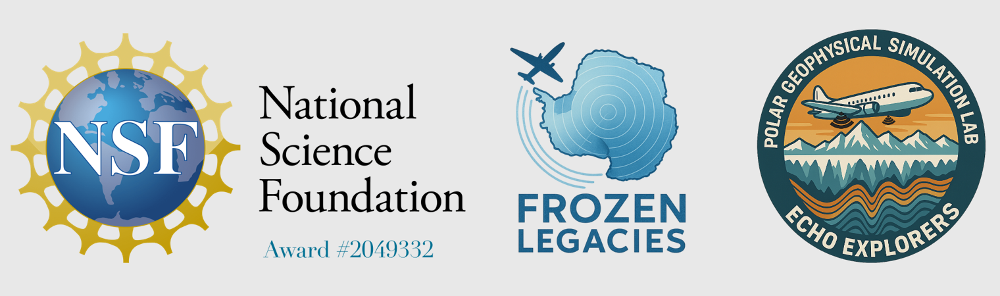

<p align="center">
  
</p>

# Frozen Legacies

Investigating 50 years of change beneath the Ross Ice Shelf using archival 60 MHz airborne radar from the 1974–75 SPRI/TUD/NSF Antarctic surveys.

## Overview

We derive **bed-echo character** (reflection coefficient R₀, power variance V_p, fading length τ_p) from archival A-scope radar data recorded on 35 mm film during 12 flights over the Ross Ice Shelf and Siple Coast ice streams. The 50-year temporal baseline, comparing 1970s radar with modern NASA Operation IceBridge, CReSIS, and ROSETTA-Ice surveys, provides the first direct measurements of basal change over half a century.

A collaboration between **Georgia Tech**, **Stanford University**, and **Colorado School of Mines**.

## Tools

### LYRA — Layered-echo Yield from Radiometric Archives

A-scope waveform extraction pipeline for raw TIFF scans of oscilloscope film.

| Phase | Script | Output |
|-------|--------|--------|
| 1. Frame detection + CBD assignment | `detect_frames.py` | `frame_index.csv`, contact sheet, OCR diagnostics |
| 2. Interactive calibration picks | `pick_calibration.py` | `cal_picks.json` |
| 3. Grid calibration | `calibrate.py` | Per-frame calibration CSV + diagnostic figures |
| 4. Echo extraction + review | `echoes.py` | Surface/bed TWT, power, SNR, width, h_air, h_ice + review overrides |
| 5. Validation | `validate_flight.py` | Multi-dataset validation figure + crossover analysis |

```bash
# Typical single-TIFF workflow
python tools/LYRA/detect_frames.py    Data/ascope/raw/125/40_0008400_0008424-reel_begin_end.tiff
python tools/LYRA/pick_calibration.py Data/ascope/raw/125/40_0008400_0008424-reel_begin_end.tiff
python tools/LYRA/calibrate.py        Data/ascope/raw/125/40_0008400_0008424-reel_begin_end.tiff
python tools/LYRA/echoes.py           Data/ascope/raw/125/40_0008400_0008424-reel_begin_end.tiff

# Or run an entire flight automatically:
python tools/LYRA/run_flight.py 126
```

**Validated on**: F125 (258 frames, 203 good), F126 (300 frames, 113 good), F128 (979 frames, 658 good), F141 (12 frames).

### Other Tools

| Tool | Purpose |
|------|---------|
| **ASTRA** | A-scope manual digitization |
| **AIRIES** | Z-scope echogram processing |
| **TERRA** | Navigation and track processing |
| **URSA** | A-scope batch processor |

## Data

- **Navigation**: 61 per-flight CSVs in `Navigation_Files/` (CBD, LAT, LON, THK, SRF; 66,141 records)
- **ASTRA picks**: 12-flight digitized A-scope picks in `Data/ascope/picks/`
- **RIGGS**: Ice thickness from the Ross Ice Shelf Geophysical and Glaciological Survey (Bentley 1984) in `Data/RIGGS/`
- **Raw TIFFs**: Not included in this repository (12 GB). Contact the team for access.

## Flights

| Flight | Region | Valid CBDs | Status |
|--------|--------|-----------|--------|
| F103 | Siple Coast / Ross Ice Shelf | 307 | ASTRA complete |
| F107 | Ross Ice Shelf NW | 423 | ASTRA complete |
| F114 | Deep interior (85°S) | 206 | ASTRA complete |
| F115 | Ross Ice Shelf | 405 | ASTRA complete |
| F125 | Roosevelt Island / Ross Ice Shelf | 565 | LYRA phase 5 validated |
| F126 | Ross Ice Shelf margin | 223 | LYRA phase 5 complete (37.7% yield) |
| F127 | Ross Ice Shelf central | 570 | LYRA queued |
| F128 | Ross Ice Shelf | 760 | LYRA phase 5 complete (67.2% yield) |
| F137 | Ross Ice Shelf NW | 146 | ASTRA complete |
| F138 | Ross Ice Shelf | 323 | ASTRA complete |
| F141 | Ross Ice Shelf | 498 | LYRA phase 3 validated |
| F143 | Ross Ice Shelf / Siple Coast | 646 | ASTRA complete |

## System Parameters

| Parameter | Value | Source |
|-----------|-------|--------|
| Frequency | 60 MHz (λ = 5 m) | Neal 1977 |
| Transmit power | 1 kW (60 dBm) | Neal 1977 Table 1.1 |
| Pulse width | 125 ns (14 MHz BW) | Neal 1977 Table 1.1 |
| Antenna gain | 10.7 dB effective | 12 dB − 1 dB cable − 0.3 dB T/R |
| Attenuator | 40 dB (confirmed F125) | ESM Figs 5.4a/b |
| MDS | −101 dBm @ 14 MHz | Neal 1977 Table 1.1 |
| Dynamic range | 70 dB | Schroeder 2021 |

## Key References

- Neal, C. S. (1977). *Radio echo studies of the Ross Ice Shelf*. PhD thesis, University of Cambridge.
- Neal, C. S. (1979). The dynamics of the Ross Ice Shelf revealed by radio echo-sounding. *J. Glaciol.*, 24(90), 295–307.
- Bentley, C. R. et al. (1979). Ice-thickness patterns and the dynamics of the Ross Ice Shelf. *J. Glaciol.*, 24(90), 287–294.
- Schroeder, D. M. et al. (2021). Archival radar data and the future of ice sheet research.
- Millar, D. H. M. (1981). *Radio echo layering in polar ice sheets*. PhD thesis, University of Cambridge.

## License

Contact the project team for licensing and data access inquiries.


